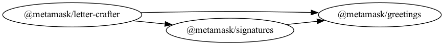

# MetaMask Monorepo Template

This monorepo is maintained in the style of the MetaMask team.

## Template Instructions

Follow these instructions when using this template.

1. Update the root package name.
   - The package name is referenced in the following places:
     - The `name` field of `package.json`
     - The title of this README
2. Update the root package description.
   - The package description is referenced at the beginning of this README and in the `description` field of `package.json`.
3. Update the `repository` field of `package.json` to point at the new repository URL.
4. Copy the `greetings/` directory within `packages/` to create a new package.
5. Update the package name.
   - The package name is referenced in the following places:
     - The `name` field of its `package.json`
     - The title of the package's README
6. Update the package description.
   - The package description is referenced at the beginning of the package's README and in the `description` field of its `package.json`.
7. Update the "Usage" and "API" sections within the package's README, removing them if they aren't needed.
8. Replace the contents of the package's `src/` directory with your own code.
9. Remove the other directories within `packages/`.
10. Replace the `references` field in `tsconfig.json` and `tsconfig.build.json` to only list your new package.
11. Replace the "Modules" section in this README to only list your new package.
12. Run `yarn generate-dependency-graph` to regenerate the graph references in the README.
13. Run `yarn constraints:fix` to ensure that all `package.json` files are correct, and use the instructions in the output to fix any lingering issues.
14. Delete these instructions.

## Modules

This repository houses the following packages:

- [`@metamask/greetings`](packages/greetings)
- [`@metamask/signatures`](packages/signatures)
- [`@metamask/letter-crafter`](packages/letter-crafter)

Or, in graph form [^fn1]:

Refer to individual packages for usage instructions.

## Learn more

For instructions on performing common development-related tasks, see [contributing to the monorepo](./docs/contributing.md).

[^fn1]: To regenerate this graph, run `yarn generate-dependency-graph`.
